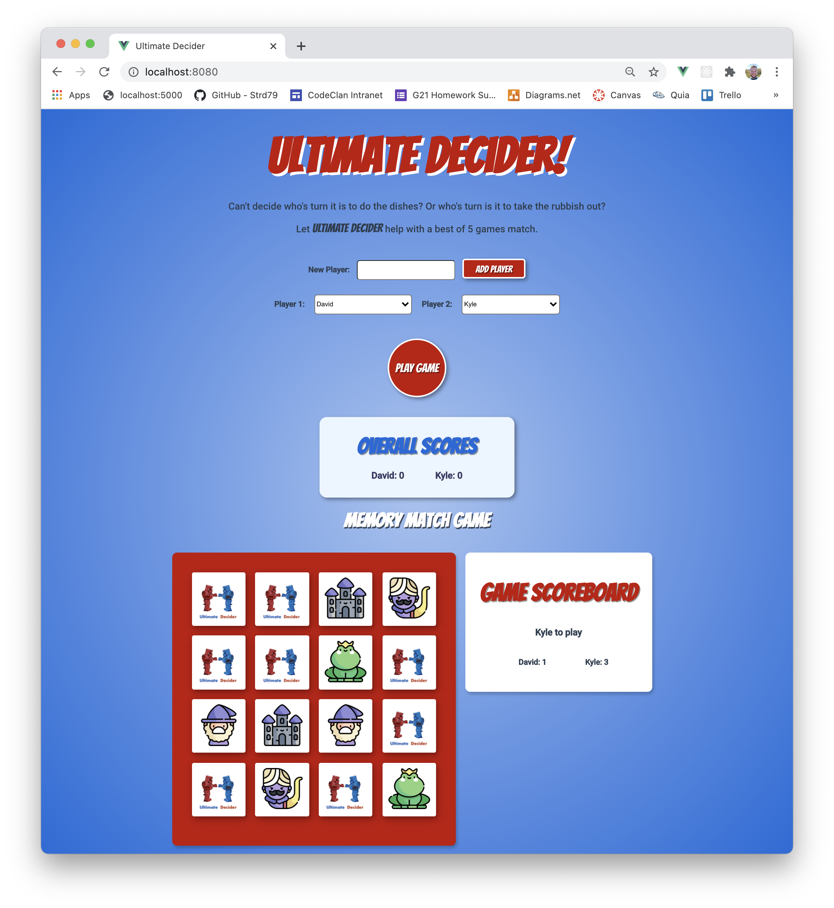
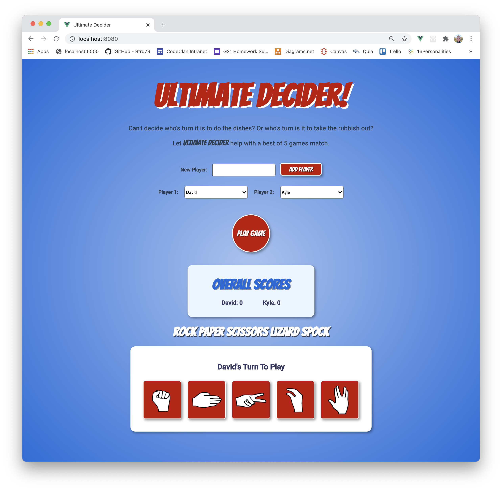

# Browser Game
This was my first group project with CodeClan, to build a Browser Game. My team consisted of Campbell Murray, Rebekah Salem-Dalgety and myself. We came up with a collection of small games, built in to one over-all game. Two players can compete to be crowned the Ultimate Decider. The intension was to make a small fun game that could be used to settle a decision between two people. 

### THE BRIEF

Create a browser game based on an existing card or dice game. Model and test the game logic and then display it in the browser for a user to interact with.

Write your own MVP with some specific goals to be achieved based on the game you choose to model.

You might use persistence to keep track of the state of the game or track scores/wins. Other extended features will depend on the game you choose.

### Game Screenshots

